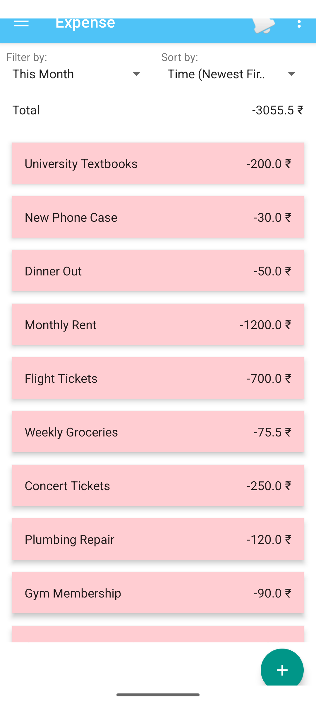
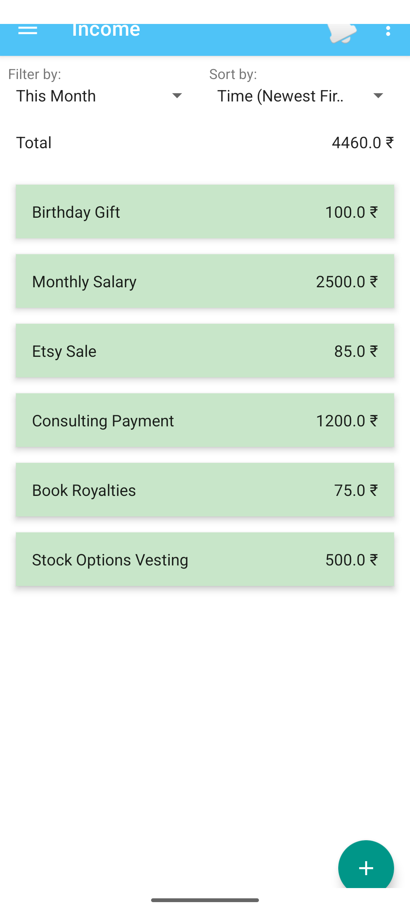

# Screenshots

<table>
<tr>
<td></td>
<td></td>
<td></td>
<td></td>
  </tr>
  <tr>
<td></td>
<td></td>
<td></td>
<td></td>
</tr>
  <tr>
<td></td>
<td></td>
<td></td>
<td></td>
</tr>
  <tr>
<td></td>
<td></td>
<td></td>
<td> </td>
</tr>
  <tr>
<td></td>
<td></td>
<td></td>
<td></td>
</tr>
  <tr>
<td></td>
<td></td>
<td></td>
<td> </td>
</tr>

</table>

